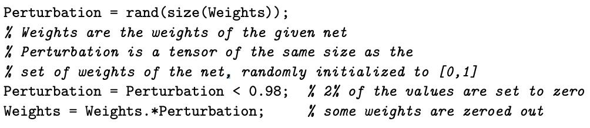
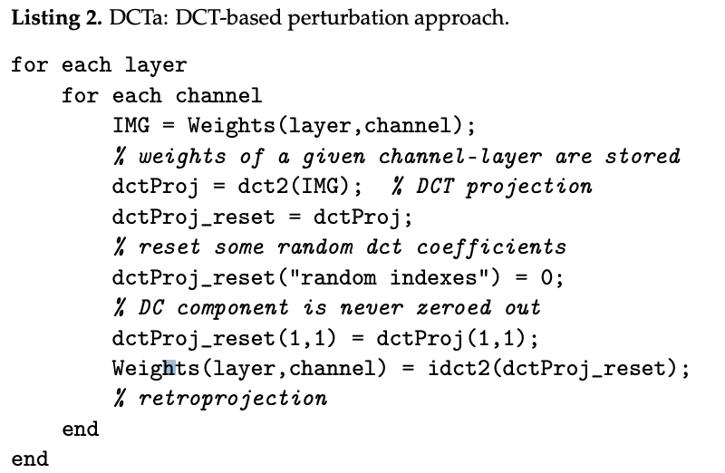
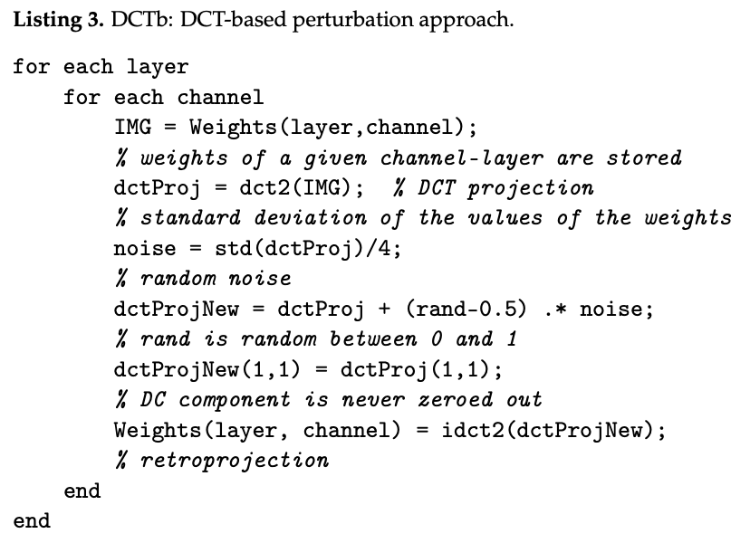
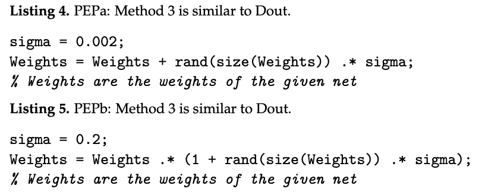

# Comparison Of Different Methods For Building Ensembles Of CNNs

The writers have used ensembles of ResNet50 and MobileNetV2. ResNet50, with 50 convolutional layers and residual blocks, mitigates the vanishing gradient problem through skip connections, enabling effective deep neural network training. Pretrained on datasets like ImageNet, it’s popular for tasks such as object detection and image recognition. Since winning ILSVRC 2015, ResNet50 has gained popularity for its effective gradient propagation and flow of lower-level information to higher layers. Figure 4 visualizes its architecture.

The stochastic approach alters activation functions in ResNet50 or MobileNetV2 by randomly replacing them with functions from a pool of candidates. This creates varied networks for the ensemble, with performance differing by CNN architecture. Referred to as “SE” in the experiments, this method avoids overfitting by randomly replacing activation functions without using specific datasets.

During training, various data-augmentation techniques are used:

- APP1: Generates three new images by reflecting the original image vertically and horizontally, and scaling it along both axes with factors between 1 and 2.
- APP2: Builds on APP1 by adding rotation (−10 to 10 degrees), translation (0 to 5 pixels), and shear transformations (0 to 30 degrees), resulting in six new images.
- APP3: Similar to APP2 but excludes shear and scale transformations, producing four new images.
- APP4: Uses PCA-based transformations to create three new images through random zeroing, noise addition, and component swapping with a 5% probability from images in the same class.
- APP5: Like APP4 but applies Discrete Cosine Transform (DCT) instead of PCA, keeping the DC coefficient unchanged.
- APP6: Applies to color images, creating three new images by color shifting, contrast alteration, and sharpness modification using Gaussian blur.

The PEP method creates ensembles by adding Gaussian random noise to the weights of a single trained network. This perturbation can enhance performance and help the model escape local minima, avoiding the cost of retraining. Variants tested include:

- Dout: Similar to dropout, zeroes out 2% of the weights.
- DCTa: Projects weights onto DCT space, zeroes 3.33% of DCT coefficients (excluding the DC component), then applies inverse DCT.
- DCTb: Projects weights onto DCT space with small random noise (excluding the DC component), then applies inverse DCT.
- PEPa: Similar to the original PEP but with a small amount of random noise.
- PEPb: Similar to PEPa.

The proposed methods use noise in back projection similar to DCT-based augmentations. They differ in how they search for new minima: DCTx and PEPx modify all parameters, while Dout zeroes out some parameters. PEPx applies noise to all parameters, while DCTx does so in the subspace. The process involves training a network for 20 epochs (netA), applying weight perturbations, then training for two more epochs to get netP. This is repeated five times to produce five netPs. The final output is the average of netA and the five netPs.

    

    

    

    

