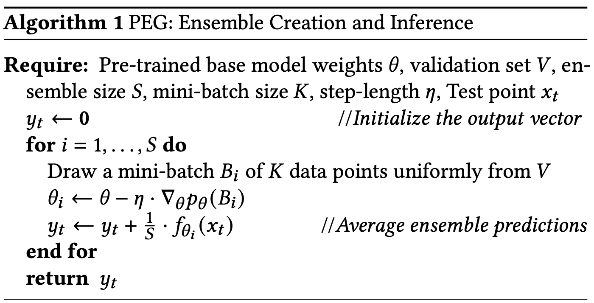

# Gradient Perturbation Based Efficient Deep Ensembles

Almost always ensembles work better than singular models, therefore it's essential to devise creative and efficient ways to train them.

One appealing approach would be to create an ensemble of models and finally average the results of those ensembles to get the final prediction over the provided input.

Training ensembles could be extremely computationally expensive thus in this articles writers have proposed **PEG** (Perturbed Ensemble method via Gradient updates). **PEG uses **validation data** to compute gradients.**

## Algorithm

PEG takes a **pre-trained** base model and applies gradient based perturbations to create an ensemble. It has to be said that it does this with restarts, more specifically perturbations are not applied in succession but rather, all perturbations are applied to the same base model.

